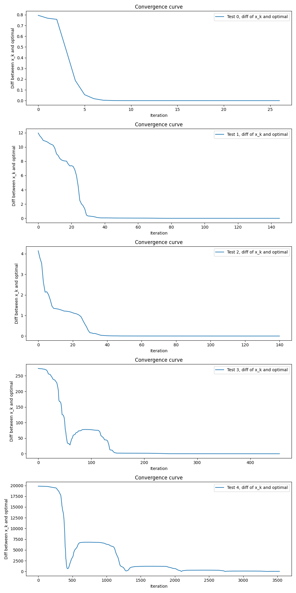

# Pay attention to use ABSOLUTE path to include ```Eigen/Dense```
I don't know why relative path doesn't work on my laptop. This is just a notification.

# Test cases
I have five test cases. The number of cols of SPD A is `[5,10,15,20,100]`.

# Workflow
**Remember to run `LBFGS.cpp` first and then `check_and_plot.py`**

All information needed to check the correctness of the implementation or plot the convergence curve is store in file `LBFGS_log.txt`.

Three parts of information are stored: 
- The theoretical optimal solution `x*`.
- The calculated solution `x`.
- The history of `x_k - x*`. 

# Check correctness of the LBFGS implementation
```python
# Check the correctness of LBFGS implementation
correct = True
for i in range(test_num-2):
    if not np.allclose(optimal_x[i], true_optimal_x[i], atol=1e-6):
        correct = False
        break
print(correct)
```

I did an element-wise check between `x` and `x*`. The threshold is `1e-6`. **The result of my check shows that the result all cases can be correctly calculated**.

# Plot the convergence
The x-axis is the iteration number. The y-axis is the norm of `x_k - x*` where `x* = Ax - b` in theory.

